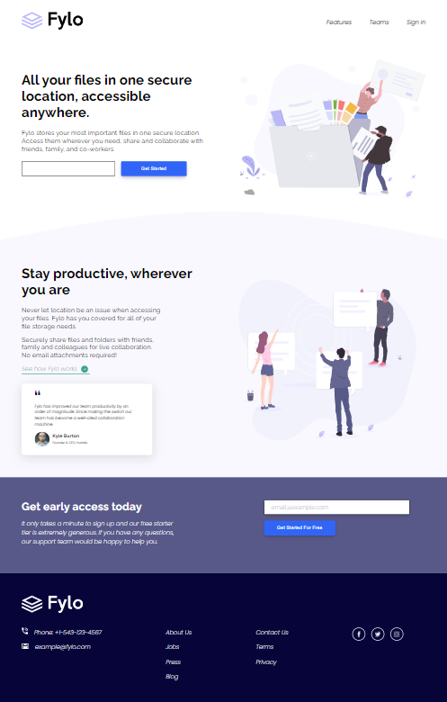

# Frontend Mentor - Fylo landing page with two column layout solution

This is a solution to the [Fylo landing page with two column layout challenge on Frontend Mentor](https://www.frontendmentor.io/challenges/fylo-landing-page-with-two-column-layout-5ca5ef041e82137ec91a50f5). 

## Table of contents

- [Overview](#overview)
  - [The challenge](#the-challenge)
  - [Screenshot](#screenshot)
  - [Links](#links)
- [My process](#my-process)
  - [Built with](#built-with)
  - [What I learned](#what-i-learned)
  - [Continued development](#continued-development)
- [Author](#author)


# Welcome! 👋

## Overview

### The challenge

Users should be able to:

- View the optimal layout for the site depending on their device's screen size
- See hover and focus states for all interactive elements on the page

### Screenshot



### Links

- Solution URL: [Add solution URL here](https://your-solution-url.com)
- Live Site URL: [Add live site URL here](https://your-live-site-url.com)

## My process

### Built with

- Semantic HTML5 markup
- CSS custom properties
- Flexbox
- Mobile-first workflow

### What I learned

I learned how to make better responsive web design and how to make drop-down menu just with CSS and HTML

```html
<h1>Some code I'm proud of</h1>
```
```css
.drop-down_menu {
    position: relative;
}
.list_drop-down {
    display: flex;
    flex-direction: column;
    position: absolute;
    top: 1.8rem;
    left: 3rem;
    list-style: none;
    max-width: 12rem;
    text-align: center;
    white-space: nowrap;
    overflow: hidden;
    text-overflow: clip;
    background-color: var(--Bright-Blue);
    border-radius: 7px;
    display: none;
}
.list_drop-down li {
    padding: .8rem 0 0.8rem;
    width: 190px;
    transition: background-color 0.2s ease;
}
.list_drop-down li a {
    width: 100%;
    height: 100%;
    display: inline-block;
    color: white;
    text-decoration: none;
}

.list_drop-down li:hover {
    background-color: var(--Moderate-Cyan);
}
.menu_options:focus + .list_drop-down {
    display: block;

}

```

### Continued development

I want to focus on creating new and more demanding websites and statr learning JavaScript to make this site more functional


## Author

- Github - [persolanstereox](https://github.com/persolanstereox)
- Facebook - [Piotr Jemielita](https://www.facebook.com/piotrek.aka.jemlit/)


